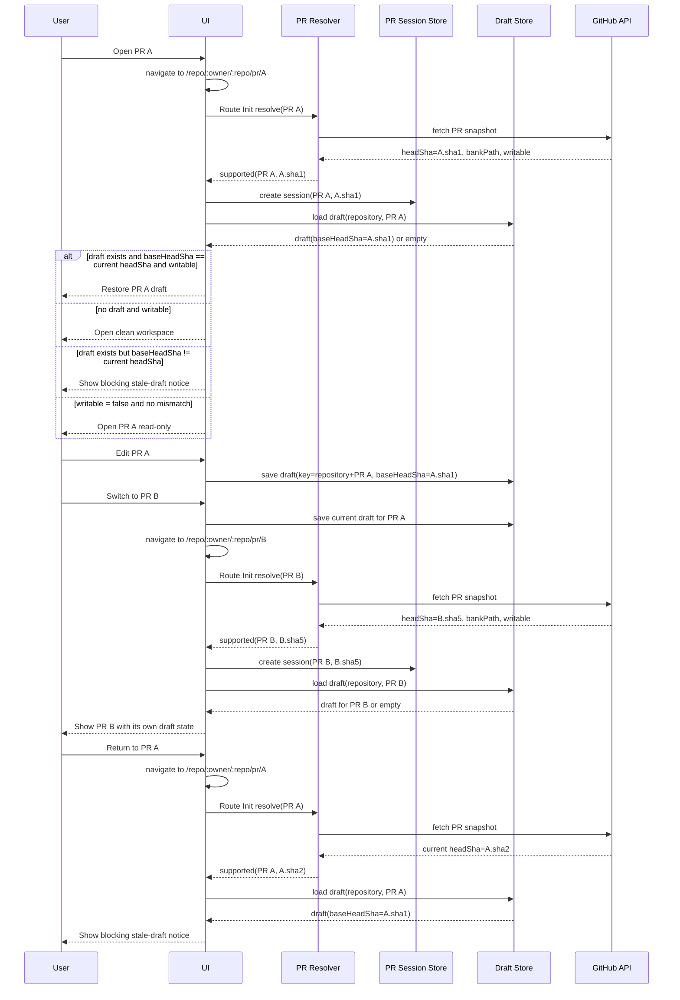

# PR-Only Workflow Simplification Design

## Goal

Упростить приложение до одной рабочей модели: пользователь всегда начинает работу из открытого PR, всегда работает с текущим head этого PR при открытии, и всегда публикует изменения обратно в этот же PR.

## Product Decisions

- Стартовая страница показывает только список открытых PR.
- Раздел `Банки` удаляется.
- Раздел `Недавние PR` удаляется.
- Прямой вход в работу без PR больше не поддерживается как пользовательский сценарий.
- Выбор `branch/main` удаляется из UI и пользовательской навигации.
- Выбор `gitsha/commit` удаляется из UI и пользовательской навигации.
- Предполагается, что каждый PR затрагивает ровно один банк.
- Если пользователю нужен более ранний `gitsha`, он меняет PR самостоятельно вне приложения.
- PR, который меняет `0` банков или больше `1` банка, считается unsupported для workspace и не открывается в редакторе.
- PR, в котором есть изменения вне `src/<bank>/...`, тоже считается unsupported для workspace и publish.

## Target User Flow

1. Пользователь открывает `Dashboard`.
2. Видит список открытых PR и фильтрует его поиском при необходимости.
3. Выбирает PR.
4. Приложение переходит на канонический workspace route этого PR.
5. `Route Init` запускает snapshot-bound PR resolver и создаёт session только если PR находится в состоянии `supported`.
6. Приложение открывает `BankWorkspace` вычисленного банка.
7. Пользователь редактирует файлы банка и запускает локальные проверки.
8. Пользователь публикует изменения обратно в текущий PR.

Если выбранный PR не маппится ровно в один банк или содержит изменения вне банка, `Route Init` не открывает workspace и возвращает пользователя на `Dashboard` с reason notice.

## UX Changes

### Dashboard

- `Dashboard` становится PR-only экраном.
- На экране остаётся только один список открытых PR.
- Поиск работает только по PR.
- Списки банков и недавних PR отсутствуют.
- Если список PR пуст, показывается только пустое состояние для PR.
- `Dashboard` явно покрывает состояния `loading`, `error`, `retry` и `empty`.

### Header

- `SourceSelector` упрощается до выбора текущего PR.
- Из шапки удаляются branch-режим и commit-dropdown.
- `sha` не показывается в UI.
- Переключение репозитория остаётся доступным.
- Переключение на другой PR из шапки использует отдельный `Switch PR` flow.

### Bank Workspace

- `BankWorkspace` открывается только из PR.
- Внутри workspace пользователь по-прежнему работает с одним банком.
- Если в URL задан файл, открывается этот файл.
- Если файл не задан, используется текущая логика выбора первого подходящего файла.

### Publish

- `PublishPanel` перестаёт быть универсальным экраном создания или обновления PR.
- `PublishPanel` поддерживает только обновление текущего PR.
- Поле заголовка PR удаляется.
- Создание новой ветки, форка и нового PR из этого сценария удаляется.
- Если PR находится в состоянии `writable = false`, workspace открывается read-only:
  - редакторы отключены;
  - создание и изменение draft'ов запрещены;
  - publish недоступен;
  - UI показывает read-only причину вместо активного publish-flow.

## Routing Model

- Стартовый маршрут `/` остаётся точкой входа в приложение.
- `/workspace` больше не нужен как самостоятельный пользовательский экран и должен редиректить на `/`.
- Канонический route workspace: `/repo/:owner/:repo/pr/:prNumber`.
- Этот route является единственным источником истины для открытого workspace.
- Любое открытие PR из `Dashboard` или из шапки сначала переводит приложение на этот route, и только `Route Init` обрабатывает вход в workspace из навигации.
- `Reload PR` и `Post-Publish Re-sync` могут заменить уже существующую session in-place без дополнительного route transition.
- Банк не кодируется в route и всегда выводится из snapshot-bound PR resolver.
- Query param `file` остаётся допустимым только для выбора файла внутри уже открытого банка.
- Если `file` query param указывает на путь вне текущего банка, несуществующий файл или любой удалённый/неоткрываемый файл, query param отбрасывается и workspace открывается с дефолтным файлом банка.
- `commit` query param больше не является частью рабочей навигации.
- Старые branch-based workspace route не должны оставаться рабочим путём приложения.

## Identifier Canonicalization

- `repository` хранится как `{ owner, repo }`.
- Route repository кодируется двумя path-параметрами: `:owner` и `:repo`.
- `repoSlug` используется только как внутреннее строковое представление `${owner}/${repo}`.
- `bankPath` хранится как `src/<bank>`.
- Любое сравнение route/session выполняется после приведения к этим каноническим форматам.

## Repository Context

- `repository` является каноническим top-level контекстом приложения.
- На cold start маршрута `/` текущим `repository` считается `config`-default repository.
- Текущий `repository` выбирается в шапке и хранится в app state.
- Список PR на `Dashboard` всегда относится только к текущему `repository`.
- Канонический workspace route всегда кодирует `owner` и `repo`, чтобы открытая workspace-ссылка была однозначной.
- При открытии канонического workspace route приложение сначала синхронизирует top-level `repository` c `owner/repo` из route, и только потом выполняет route init.
- Если `owner/repo` из route невалидны или не могут быть выбраны как repository context, приложение возвращается на `Dashboard` config-default repository с notice.
- Если пользователь меняет `repository`, текущая PR session немедленно завершается.
- Перед сменой `repository` текущее локальное состояние PR должно быть уже сохранено в draft store.
- При смене `repository` приложение не удаляет сохранённые draft'ы старого репозитория; они остаются доступны при возврате в соответствующий PR.
- При смене `repository` приложение завершает текущую session и возвращает пользователя на `Dashboard` нового репозитория.

## PR Resolution Contract

Один и тот же resolver должен использоваться для:

- открытия PR из `Dashboard`;
- инициализации канонического workspace route;
- проверки актуальности активной PR session;
- preflight перед publish.

Resolver возвращает одно из состояний:

- `supported`:
  - PR доступен;
  - PR открыт;
  - все изменения лежат внутри `src/<bank>/...`;
  - все такие изменения относятся ровно к одному банку;
  - возвращаются `headSha`, `bankPath`, `writable`, `readOnlyReason` и `changedFiles`.
- `unsupported(reason)`:
  - `no-bank-changes`;
  - `multiple-banks`;
  - `outside-bank-scope`.
- `unavailable(reason)`:
  - `not-found`;
  - `closed`;
  - `merged`;
  - `inaccessible`.
- `transient-error(reason)`:
  - `network`;
  - `timeout`;
  - `rate-limit`;
  - `unknown`.

Поле `writable` определяется отдельно от поддержки workspace:

- `writable = true`, если текущий пользователь может обновлять head выбранного PR;
- `writable = false`, если workspace можно открыть только read-only, без draft creation и без publish.

Поле `readOnlyReason`:

- `null`, если `writable = true`;
- каноническое значение причины, если `writable = false`;
- UI не вычисляет причину read-only режима самостоятельно вне resolver result.

Допустимые значения `readOnlyReason`:

- `no-write-access`

Resolver обязан быть snapshot-bound:

- один вызов resolver должен возвращать согласованный набор `headSha + changedFiles + bankPath + writable`;
- `headSha`, на котором основан resolver result, становится единственным источником истины для создания или re-check PR session;
- UI и session-store не должны самостоятельно собирать этот набор из нескольких несвязанных запросов.

Формат `changedFiles` в resolver result:

- каждый элемент — канонический change descriptor;
- поля:
  - `kind`: `add | modify | delete | rename`;
  - `path`: текущий путь файла;
  - `oldPath`: обязателен только для `rename`;
- все правила bank-resolution и publish preflight используют именно этот формат.

## Bank Resolution Rule

Определение "ровно одного банка" должно быть единым и использоваться одинаково в open-flow, route init, re-check active session и publish preflight.

Правило:

- функция принимает на вход произвольный список changed paths;
- каждый путь обязан лежать внутри `src/<bank>/...`;
- `bankPath` вычисляется как `src/<bank>`;
- удаление файла считается изменением по его удалённому пути;
- rename считается unsupported, если старый и новый путь дают разные `bankPath` или если любой из путей выходит за `src/<bank>/...`;
- если после разбора changed paths получаем ровно один `bankPath`, PR считается bank-supported;
- в любом другом случае результат — `unsupported`.

Использование этой функции:

- open-flow: вход = `resolver.changedFiles`;
- route init: вход = `resolver.changedFiles`;
- re-check active session: вход = `resolver.changedFiles`;
- publish preflight: bank-resolution не пересчитывает итоговый diff PR, а использует `resolver.changedFiles` как источник истины по bank scope текущего PR.

Нормализация локальных draft operations:

- `create/update` -> `upsert(path)`;
- `delete` -> `delete(path)`;
- `rename/move` -> `delete(oldPath) + upsert(newPath)` до передачи в bank-resolution.

Проверка локальных draft operations перед publish:

- каждая локальная draft operation должна лежать внутри `session.bankPath`;
- если локальная draft operation выходит за `session.bankPath`, publish блокируется;
- локальные draft operations не пересчитывают bank scope PR, а только проверяются на согласованность с уже выбранным банком workspace.

## Draft Resolution Order

Решение о том, как открыть workspace для конкретного PR, должно приниматься в одном и том же порядке в open-flow через `Route Init` и в `Reload PR`.

Вход:

- `PR session`, созданная из snapshot-bound resolver result;
- draft по ключу `repository + prNumber`, если он существует.

Порядок:

1. Если draft существует и `draft.baseHeadSha !== session.headSha`, открыть blocking-state stale-draft c действиями `Discard stale draft and open latest PR` и `Back to Dashboard`, и не применять draft автоматически.
2. Иначе, если `session.writable = false`, открыть PR в read-only режиме и не применять draft автоматически.
3. Иначе, если draft отсутствует, открыть clean workspace.
4. Иначе восстановить draft в workspace.

Следствия:

- stale-draft mismatch имеет приоритет над read-only режимом;
- read-only режим не удаляет draft и не считается его implicit discard;
- один и тот же порядок обязан использоваться во всех entry-point flow.

## Canonical Algorithms

### Open PR

1. Построить канонический route `/repo/:owner/:repo/pr/:prNumber` для выбранного PR.
2. Перейти на этот route.
3. Дальнейшее создание session, загрузка draft и выбор режима workspace для initial open происходят через `Route Init`.

### Switch PR

1. Сохранить текущее локальное состояние активного PR в draft store.
2. Завершить текущую session без удаления draft'ов.
3. Запустить `Open PR` для выбранного PR.

### Route Init

1. Считать `owner`, `repo` и `prNumber` из route.
2. Попытаться синхронизировать top-level `repository` c `owner/repo` из route.
3. Если `owner/repo` невалидны или не могут быть выбраны как repository context, редиректить на `/` config-default repository с notice.
4. Если `prNumber` невалиден, редиректить на `/` уже синхронизированного route repository с notice.
5. Запустить snapshot-bound PR resolver.
6. Если результат `unsupported` или `unavailable`, редиректить на `/` текущего route repository с notice.
7. Если результат `transient-error`, остаться на route и показать retry state без создания session.
8. Если результат `supported`, создать `PR session` из resolver result.
9. Загрузить draft по ключу `repository + prNumber`.
10. Применить `Draft Resolution Order`.

### Re-check Active Session

1. Запустить snapshot-bound PR resolver для текущего PR.
2. Если результат `unsupported` или `unavailable`, перевести workspace в blocking-state без редактирования.
3. Если результат `transient-error`, оставить текущую session без изменений и показать retryable notice.
4. Если результат `supported` и `headSha !== session.headSha`, сохранить текущий draft по ключу `repository + prNumber` с полем `baseHeadSha = session.headSha`, перевести workspace в `stale PR` и не применять draft к новому head.
5. Если результат `supported` и `headSha === session.headSha`, но `writable = false`, сначала сохранить текущее in-memory состояние в draft этого PR, затем перевести workspace в read-only и запретить draft mutations и publish.
6. Если результат `supported` и `headSha === session.headSha` и `writable = true`, продолжать работу в обычном режиме.

### Publish Preflight

1. Проверить, что текущая session существует.
2. Запустить snapshot-bound PR resolver для текущего PR.
3. Если resolver вернул `unsupported` или `unavailable`, заблокировать publish.
4. Если resolver вернул `transient-error`, заблокировать publish и показать retryable reason.
5. Если `resolver.headSha !== session.headSha`, перевести workspace в `stale PR` и заблокировать publish.
6. Если `resolver.writable = false`, заблокировать publish в read-only причине.
7. Проверить, что `resolver.changedFiles` всё ещё соответствуют `session.bankPath`.
8. Нормализовать локальные draft operations и проверить, что каждая операция лежит внутри `session.bankPath`.
9. Проверить наличие локальных изменений.
10. Прогнать bank-level validation.
11. Разрешить publish только если все проверки прошли.

### Reload PR

1. Запустить snapshot-bound PR resolver для текущего PR.
2. Если результат `unsupported` или `unavailable`, не удалять сохранённый draft текущего PR автоматически, показать blocking-state и отправить пользователя на `Back to Dashboard`.
3. Если результат `transient-error`, оставить старую stale-session в blocking-state и показать retry action без удаления draft'а.
4. Если результат `supported`, создать новую PR session из resolver result.
5. Загрузить draft по ключу `repository + prNumber`.
6. Применить `Draft Resolution Order`.
7. Если результатом стал stale-draft blocking-state, основными действиями остаются `Discard stale draft and open latest PR` и `Back to Dashboard`.
8. Если на любом шаге reload завершается ошибкой сети или доступа, оставить старую stale-session в blocking-state без удаления draft'а.

### Discard Stale Draft And Open Latest PR

1. Явно удалить draft по ключу `repository + prNumber`.
2. Повторно запустить `Open PR`.

### Post-Publish Re-sync

1. После успешного publish не мутировать текущую session вручную по одному `headSha`.
2. Вместо этого повторно запустить snapshot-bound PR resolver для текущего PR.
3. Если resolver вернул `supported`, создать новую PR session из его полного результата.
4. После успешного `supported` re-sync удалить draft этого PR, потому что изменения уже опубликованы.
5. Перечитать workspace из новой session.
6. Если resolver вернул `unsupported` или `unavailable`, не удалять draft этого PR автоматически, показать blocking-state и оставить пользователю `Retry` или `Back to Dashboard`.
7. Если resolver вернул `transient-error`, оставить текущий workspace в retryable blocking-state и не удалять draft этого PR автоматически.

## Entry-Point Outcome Matrix

- `Dashboard -> Open PR`:
  - всегда сначала навигирует на канонический route;
  - все дальнейшие outcome полностью определяются `Route Init`.
- `Route Init`:
  - invalid `owner/repo` -> редиректить на config-default `Dashboard` с notice;
  - invalid `prNumber` -> редиректить на `Dashboard` уже синхронизированного `repository` с notice;
  - `supported` + mismatched `baseHeadSha` -> blocking-state с уведомлением о невалидном draft;
  - `supported` + (`writable = false`) + no mismatch -> read-only workspace без автоприменения draft;
  - `supported` + no draft + `writable = true` -> открыть clean workspace;
  - `supported` + matching `baseHeadSha` + `writable = true` -> восстановить draft;
  - `unsupported` -> редиректить на `Dashboard` того же `repository` с notice;
  - `unavailable` -> редиректить на `Dashboard` того же `repository` с notice;
  - `transient-error` -> остаться на route и показать retry state.
- `Active Session Re-check`:
  - `supported` + same `headSha` + `writable = true` -> обычный режим;
  - `supported` + same `headSha` + `writable = false` -> сохранить текущее состояние в draft и перейти в read-only режим;
  - `supported` + new `headSha` -> `stale PR`;
  - `unsupported` -> blocking-state в текущем workspace;
  - `unavailable` -> blocking-state в текущем workspace;
  - `transient-error` -> текущая session остаётся открытой, показывается retryable notice.

## Recovery Actions

- `Discard stale draft and open latest PR`:
  - удалить draft текущего PR;
  - повторно открыть текущий PR по latest head.
- `Back to Dashboard`:
  - завершить текущую session;
  - не удалять draft автоматически.
- `Retry`:
  - повторить resolver или route init без изменения draft.

## Diagrams

### Dataflow

```mermaid
flowchart LR
    U[User] --> UI[UI: Dashboard / Header / Workspace]

    UI --> R[PR Resolver]
    UI --> S[PR Session Store]
    UI --> D[(Draft Store)]
    UI --> P[Publish Flow]

    R --> GH[(GitHub API)]
    GH --> R

    R -->|supported {repository, prNumber, bankPath, headSha, writable, readOnlyReason, changedFiles}| UI
    UI --> S
    S --> UI

    D -->|key = repository + prNumber| UI
    D -->|value = {baseHeadSha, localChanges, metadata}| UI

    UI --> DECIDE{baseHeadSha == headSha?}
    DECIDE -->|no| STALE[Blocking stale-draft state]
    DECIDE -->|yes| MODE{writable?}
    MODE -->|no| READONLY[Open read-only workspace]
    MODE -->|yes and draft exists| RESTORE[Restore draft]
    MODE -->|yes and no draft| CLEAN[Open clean workspace]

    S --> W[Workspace Loader]
    W --> GH
    GH --> W
    W --> UI

    UI --> V[Bank Validation]
    D --> V
    S --> V
    V --> UI

    P --> S
    P --> D
    P --> V
    P --> GH
    GH --> P
```

### Sequence



## Draft Lifecycle

- У каждого PR может быть только один draft пользователя.
- Draft key: `repository + prNumber`.
- Draft value обязан содержать `baseHeadSha`, локальные изменения и служебные metadata.
- Переключение между PR не удаляет draft'ы и не требует discard-подтверждения.
- При возврате в PR с тем же `headSha` draft восстанавливается автоматически.
- При возврате в PR с другим `headSha` draft не восстанавливается автоматически и считается невалидным для нового snapshot.
- Успешный `Post-Publish Re-sync` удаляет draft этого PR, потому что изменения уже опубликованы.
- Draft'ы других PR не затрагиваются publish/update операциями текущего PR.
- Draft'ы сохраняются между рестартами приложения.
- Если PR открывается в `writable = false`, существующий draft этого PR не восстанавливается автоматически.

## Navigation Rules

- Навигация между PR, переход на `Dashboard`, смена `repository`, browser `back/forward` и прямая навигация по URL не требуют discard-подтверждения.
- Перед любой навигацией текущее локальное состояние активного PR должно быть сохранено в его draft.
- Уничтожение draft возможно только явным действием пользователя или после успешного `Post-Publish Re-sync`.

## Session Model

Приложение должно работать с одной узкой сущностью: `PR session`.

Минимальное содержимое сессии:

- `repository`
- `prNumber`
- `bankPath`
- `headSha`
- `writable`
- `readOnlyReason`

Правила:

- При открытии PR приложение создаёт новую `PR session` только из snapshot-bound результата resolver.
- Все чтения tree/files в рамках открытого workspace выполняются по `headSha` этой сессии.
- Во время уже открытой сессии приложение не должно молча переключаться на новый head PR.
- Любой re-check активной session начинается с PR resolver и сравнивает его snapshot-bound результат с текущей session.
- `sha` остаётся только внутренним системным snapshot-идентификатором.
- `sha` не участвует в пользовательском выборе и не показывается в UI.

## State Ownership

- `repository`: top-level app state и route context.
- `prNumber`: route context и PR session.
- `bankPath`: вычисляется resolver и хранится в PR session, но не кодируется в route.
- `headSha`: вычисляется resolver и хранится в PR session.
- `writable`: вычисляется resolver и хранится в PR session.
- `readOnlyReason`: вычисляется resolver и хранится в PR session.
- `changedFiles`: принадлежат snapshot-bound resolver result и используются в open/re-check/publish preflight как данные текущего PR snapshot.
- `draft`: хранится отдельно от session по ключу `repository + prNumber` и содержит `baseHeadSha`.

## Stale Session Rules

Если у открытого PR меняется head, текущая сессия становится устаревшей.

Проверка актуальности выполняется в двух точках:

- когда приложение снова получает фокус;
- перед публикацией изменений в PR.

Поведение:

- если `currentHeadSha === sessionHeadSha`, приложение продолжает работу;
- если `currentHeadSha !== sessionHeadSha`, workspace переходит в состояние `stale PR`.

Поведение в `stale PR`:

- редактирование блокируется;
- публикация блокируется;
- пользователь видит сообщение, что PR обновился в GitHub и текущий draft привязан к старому snapshot;
- draft этого PR сохраняется с его старым `baseHeadSha`;
- draft не применяется автоматически к новому head;
- основное действие экрана: `Discard stale draft and open latest PR`.
- дополнительное действие: `Back to Dashboard`.
- система не очищает draft автоматически при обнаружении stale-состояния.
- если ранее writable session после re-check становится `writable = false` при том же `headSha`, существующий draft этого PR не восстанавливается автоматически и PR открывается только в read-only режиме.

Система не должна:

- автоматически переносить локальные draft'ы на новый head;
- выполнять скрытый merge/rebase;
- продолжать работу в новой head-версии PR без явной перезагрузки.

Если re-check активной сессии возвращает не `supported`, а `unsupported` или `unavailable`:

- workspace переходит в blocking-state;
- редактирование и publish блокируются;
- пользователь получает одну причину отказа;
- основное действие зависит от причины:
  - для `unsupported` — `Back to Dashboard`;
  - для `unavailable` — `Back to Dashboard`.

## Draft Model

У каждого PR есть не более одного draft.

Ключ draft:

- `repository`
- `prNumber`

Содержимое draft:

- `baseHeadSha`
- локальные изменения
- metadata, нужные для восстановления редактора

Следствия:

- draft одного PR не конфликтует с draft другого PR;
- один и тот же PR восстанавливает свой draft при возврате, если `baseHeadSha` совпадает с текущим `headSha`;
- при несовпадении `baseHeadSha` и текущего `headSha` draft остаётся сохранённым, но не восстанавливается автоматически;
- `writable = false` не удаляет существующий draft, но и не применяет его автоматически в workspace.

## Publish Rules

Публикация работает только как update текущего PR.

Перед publish обязательно проверяется:

- PR session не устарела;
- есть локальные изменения;
- resolver по-прежнему видит PR как одно-банковый и привязанный к `session.bankPath`;
- все локальные draft operations лежат внутри `session.bankPath`;
- локальная bank-level валидация проходит.

Если хотя бы одна проверка не проходит:

- publish блокируется;
- пользователю показывается одна конкретная причина;
- если одновременно выполнены `headSha` mismatch и `writable = false`, канонической причиной считается `stale PR`;
- если PR устарел, основной путь восстановления — `Reload PR`.

После успешного publish:

- приложение выполняет `Post-Publish Re-sync`;
- новая PR session создаётся только из полного snapshot-bound resolver result;
- draft'ы старой сессии удаляются только после успешного re-sync;
- workspace перечитывается из новой session.

## Initialization Rules

- Приложение должно уметь открываться без активной рабочей сессии.
- `Dashboard` не должен зависеть от предварительной инициализации `main` branch.
- Приложение не восстанавливает последнюю PR session из local storage.
- Приложение хранит draft'ы PR между рестартами.
- Cold start на `/` открывает `Dashboard` текущего выбранного репозитория.
- Cold start на каноническом PR route выполняет `Route Init` без промежуточного открытия `Dashboard`.
- PR session создаётся только при явном открытии PR из списка или по каноническому workspace route.
- При входе по каноническому workspace route приложение всегда выполняет `Route Init`, а не отдельную special-case ветку cold start.
- `Reload PR` и `Post-Publish Re-sync` не считаются новым входом по route и поэтому могут обновлять session на уже открытом каноническом route.

## Data and Code Simplification Targets

Из продукта и кода должны уйти следующие понятия как часть пользовательской модели:

- bank-first вход;
- branch-based working source;
- commit selection;
- recent banks;
- recent PRs;
- create-PR mode в publish flow.

Допустимо оставить только внутренние технические детали, необходимые для:

- чтения GitHub tree/files по snapshot;
- проверки устаревания сессии;
- обновления текущего PR.
- проверки writable/read-only статуса выбранного PR.

## Migration Principles

- Упрощение выполняется как сужение системы до PR-only модели, а не как добавление нового параллельного режима.
- Старые branch/commit-пути не должны оставаться частью основной архитектуры.
- Избыточные абстракции источников (`branch` и `pr` как равноправные рабочие режимы) должны быть удалены, а не спрятаны.
- Любая оставшаяся логика вокруг `sha` допустима только как скрытая внутренняя деталь `PR session`.
- Старые persisted selection-данные для branch-based режима не должны использоваться для восстановления состояния.
- Legacy branch/commit deep links и лишние query combinations не должны переводиться в новую модель автоматически; они должны редиректить на `Dashboard` с notice.

Поддерживаемые legacy migration inputs:

- `/workspace` -> редирект на `/`;
- `/pr/:prNumber` -> редирект на `/` без попытки открыть PR напрямую;
- `/bank/:bankKey/repo/:repoSlug/branch-or-pr/:branchOrPr` -> редирект на `/`;
- любой legacy route с query `commit=...` -> редирект на `/`;
- любой legacy route с branch-based `branchOrPr` значением -> редирект на `/`.

## Out of Scope

- Изменение правил валидации форматов.
- Изменение логики редактирования форматов и senders внутри банка.
- Поддержка multi-bank PR.
- Автоматическое разрешение конфликтов при обновлении head PR.
- Создание PR из приложения.
- Поддержка publish в unwritable PR.

## Success Criteria

- Пользователь может начать работу только через открытый PR.
- На `Dashboard` нет банков и нет списка недавних PR.
- В шапке нельзя выбрать branch или commit.
- Workspace не открывается как отдельный branch-based режим.
- Открытый workspace всегда соответствует одному зафиксированному `headSha`.
- При обновлении PR в GitHub устаревшая сессия корректно блокируется и требует reload.
- Publish обновляет только текущий PR и не умеет создавать новый PR.
- PR с outside-bank изменениями, multi-bank изменениями или без bank-изменений не открывается в workspace.
- Unwritable PR открывается только в read-only режиме с канонической причиной из resolver.
- Пользователь может переключаться между разными PR без потери их локальных draft'ов.
- При возврате в PR с тем же `headSha` пользователь видит свой сохранённый draft.
- При возврате в PR с новым `headSha` старый draft не применяется автоматически и пользователь получает уведомление о невалидном draft.
